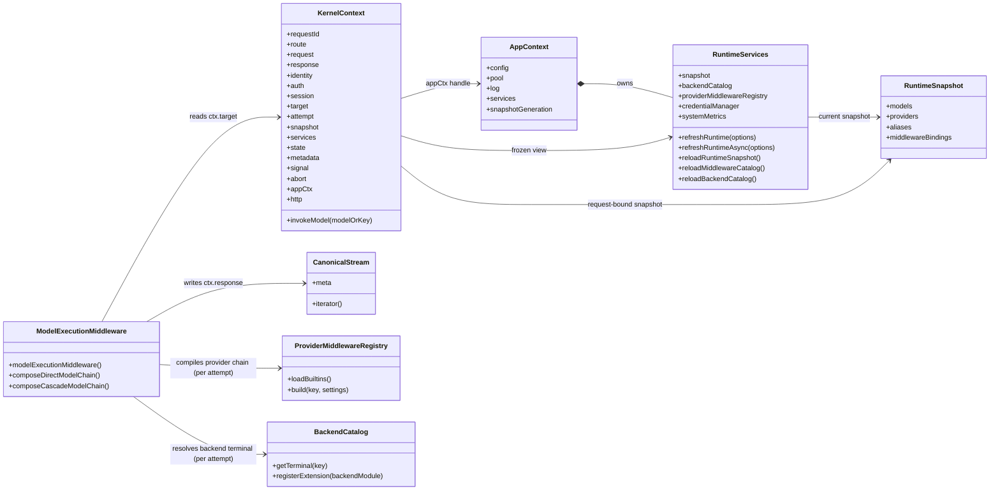
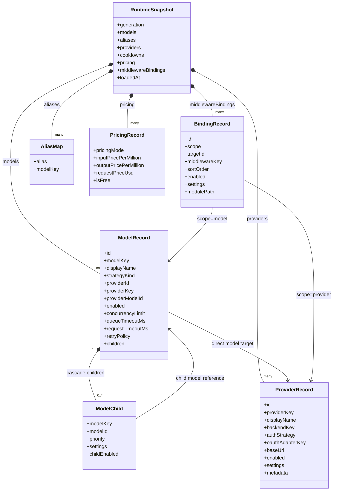
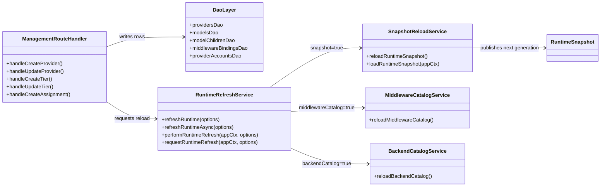
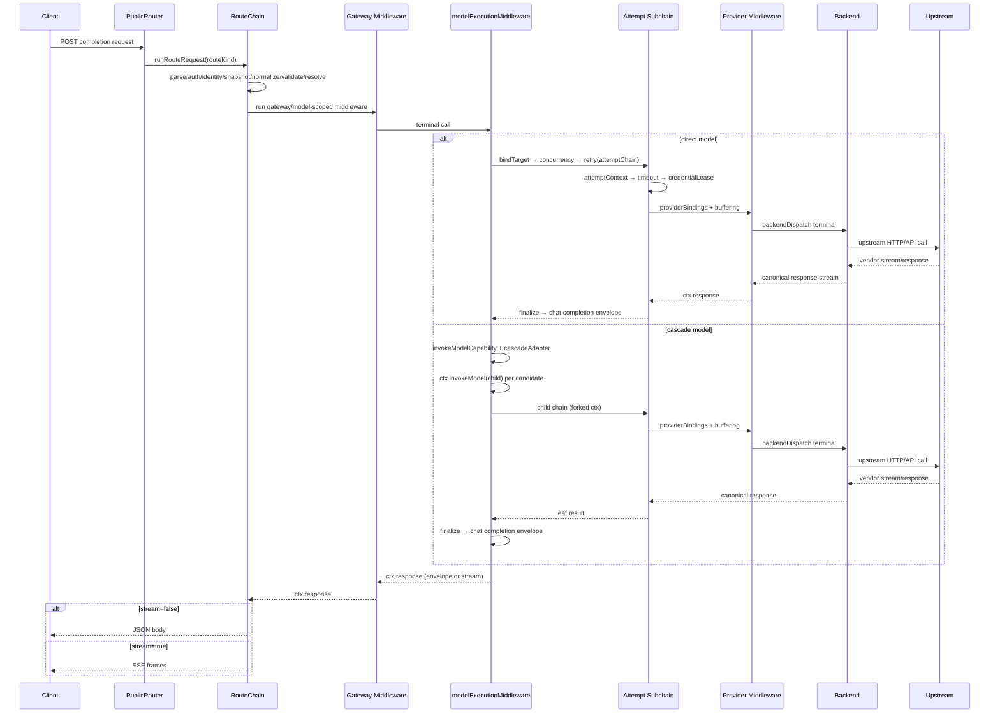
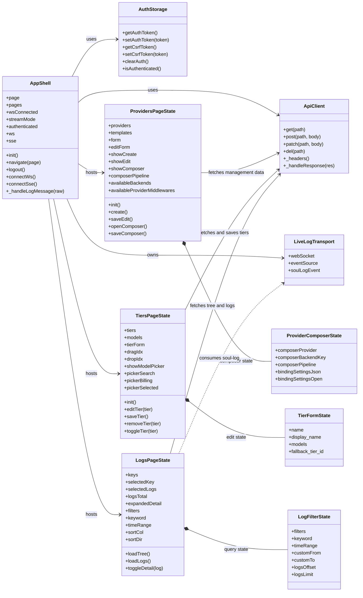
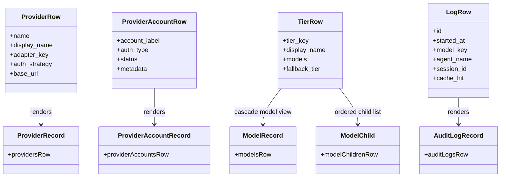
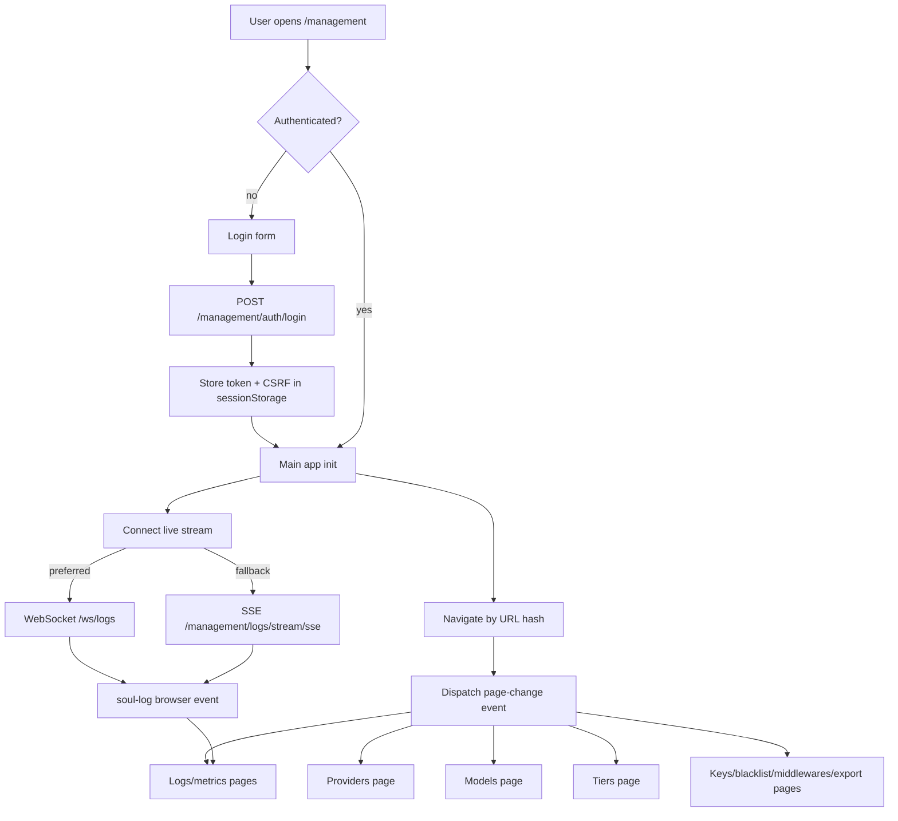

# Soul Gateway Backend And UI Flows

## Purpose

This document explains how the current `soul-gateway/src/` runtime works after the middleware-first refactor, with an emphasis on:

- the public request path
- model and provider execution
- management/dashboard mutation flows
- the dashboard UI's data-loading and live-update behavior

This is a current-state architecture note for operators and developers. It is not a migration plan.

## Core runtime model

The current runtime has one execution model: middleware.

At a high level:

- the public API enters a route middleware chain
- the route chain resolves a model and session
- gateway middleware runs around a dispatch terminal
- the dispatch terminal ends with `modelExecutionMiddleware()`
- `modelExecutionMiddleware()` either:
  - runs a direct model through provider middleware + backend terminal
  - runs a cascade model through cascade middleware, which invokes child models
- the response comes back as either:
  - a buffered completion object
  - a canonical event stream for SSE

Compatibility surfaces still exist at the HTTP/UI boundary:

- `/management/tiers` is a compatibility namespace over cascade models

## Backend flow

### 1. Public request entry

The public router accepts:

- `POST /v1/chat/completions`
- `POST /v1/messages`
- `POST /v1/responses`

All three completion routes call the same route runtime, with only `routeKind` changing.

Main entrypoints:

- `src/public-api/register-routes.mjs`
- `src/runtime/route/run-route-request.mjs`

### 2. Route middleware chain

The route chain is composed in this order:

1. `errorBoundary`
2. `parseBody`
3. `authenticate`
4. `identity`
5. `bindSnapshot`
6. `normalizeIngress`
7. `validateRequest`
8. `resolveModel`
9. `resolveSession`
10. `respond`
11. `gatewayDispatch`

`respond` is intentionally placed before `gatewayDispatch` in the array so its post-phase runs after dispatch has produced `ctx.response`.

### 3. Gateway dispatch

`gatewayDispatch` (terminal middleware) does two things:

1. compiles gateway-scope middleware from `middleware_bindings`
2. composes those middlewares around `modelExecutionMiddleware()` and runs the kernel chain on the same `ctx`

Gateway middleware is resolved from:

- global `scope='gateway'` bindings
- model `scope='model'` bindings for the resolved model id

This means gateway policy and model policy are compiled into one outer chain that wraps model execution.

### 4. Model execution middleware

`modelExecutionMiddleware()` reads `ctx.target.model` and branches on `model.strategyKind`:

- `direct` — composes and runs the direct-model chain (`composeDirectModelChain()`)
- `cascade` — composes and runs the cascade chain (`composeCascadeModelChain()`)

There is no helper that returns a result envelope; both branches write `ctx.response` and execution metadata directly to the kernel ctx.

### 5. Direct-model chain

`composeDirectModelChain()` returns the ordered middleware list:

1. `bindDirectTargetMiddleware()` — normalizes the model record and resolves the provider record from the snapshot, attaching both to `ctx.target`
2. `concurrencyMiddleware()` — outermost slot lifecycle (held across retries)
3. `retryMiddleware({ attemptChain })` — wraps the per-attempt subchain with HTTP retry semantics
4. `finalizeDirectResultMiddleware()` — converts the buffered shape into the chat-completion envelope (or flags streaming)

The per-attempt subchain inside the retry middleware is:

1. `attemptContextMiddleware()` — clones `ctx.request` and resets attempt-local state in a forked context
2. `timeoutMiddleware()` — installs `ctx.signal` for the duration of the attempt
3. `credentialLeaseMiddleware()` — leases provider credentials; releases in `finally`
4. `providerBindingsMiddleware()` (terminal) — compiles `middleware_bindings(scope='provider')` for the resolved provider against `providerMiddlewareRegistry`, then runs:
    - non-streaming: `[bufferingMiddleware, ...providerMiddlewares, backendDispatchMiddleware]`
    - streaming: `[...providerMiddlewares, backendDispatchMiddleware]`

`backendDispatchMiddleware()` is the terminal: it resolves the precompiled terminal middleware from `backendCatalog.getTerminal(ctx.target.provider.backendKey)` and invokes it. The terminal was wrapped once at catalog-registration time via `createBackendTerminal(backendModule)`, so there is no per-request adapter step.

### 6. Cascade chain

`composeCascadeModelChain()` returns:

1. `finalizeDirectResultMiddleware()` — preserves a child envelope/stream as-is, or wraps a buffered leaf result into the chat-completion envelope after the cascade unwinds
2. `invokeModelCapabilityMiddleware()` — installs `ctx.invokeModel(...)` so cascade can re-enter the model-execution chain for each child
3. `cascadeAdapterMiddleware()` (terminal) — runs `cascadeMiddleware` against the cascade model's children, dispatching each candidate through `ctx.invokeModel`

Each `ctx.invokeModel(child)` call composes a fresh direct or cascade chain in a forked child kernel context and returns that finished child ctx, isolating the parent's `ctx.target`, `ctx.attempt`, and `ctx.response` until the child succeeds.

### 6. Response egress

The route-level `respond` middleware branches on the shape of `ctx.response`:

- if it is buffered:
  - serialize to JSON in the route's ingress/egress format
- if it is a `CanonicalStream`:
  - convert canonical events to SSE frames for:
    - OpenAI Chat
    - Anthropic Messages
    - OpenAI Responses

So streaming is a route concern at the edge, while upstream/provider execution stays in canonical event form.

## Backend structural diagrams

Soul Gateway is mostly written in functional JavaScript, not ES `class` declarations.

The diagrams below use Mermaid `classDiagram` blocks as structural diagrams for:

- long-lived service objects
- request-scoped context objects
- frozen snapshot records
- stateful dashboard view-models

They should be read as "object shape and ownership" diagrams, not as literal inheritance hierarchies in the code.

### Backend runtime object diagram

### Runtime snapshot and normalized storage diagram

### Management mutation and refresh diagram

## Backend diagram

Every node in this flow is labeled by type: **router**, **middleware**, **terminal middleware**, **helper**, or **service**.

```mermaid
flowchart TD
    A[Public API Route\n/v1/chat/completions\n/v1/messages\n/v1/responses\nrouter] --> B[runRouteRequest\nhelper]
    B --> C[Route Middleware Chain]

    C --> C1[parseBody\nmiddleware]
    C1 --> C2[authenticate\nmiddleware]
    C2 --> C3[identity\nmiddleware]
    C3 --> C4[bindSnapshot\nmiddleware]
    C4 --> C5[normalizeIngress\nmiddleware]
    C5 --> C6[validateRequest\nmiddleware]
    C6 --> C7[resolveModel\nmiddleware]
    C7 --> C8[resolveSession\nmiddleware]
    C8 --> C9[respond post-phase\nmiddleware]
    C9 --> D[gatewayDispatch\nterminal middleware]

    D --> E[compile gateway middleware plan]
    E --> F[modelExecutionMiddleware\nterminal middleware]

    F --> G{model.strategyKind}
    G -->|direct| H[composeDirectModelChain]
    G -->|cascade| I[composeCascadeModelChain]

    H --> H1[bindDirectTarget\nmiddleware]
    H1 --> H2[concurrency\nmiddleware]
    H2 --> H3[retry\nmiddleware]
    H3 --> H4[attemptContext\nmiddleware]
    H4 --> H5[timeout\nmiddleware]
    H5 --> H6[credentialLease\nmiddleware]
    H6 --> H7[providerBindings\nterminal]
    H7 --> H8[buffering?\nmiddleware]
    H8 --> H9[provider middleware chain]
    H9 --> H10[backendDispatch\nterminal middleware]
    H10 --> H11[finalizeDirectResult\nmiddleware]

    I --> I1[finalizeDirectResult\nmiddleware]
    I1 --> I2[invokeModelCapability\nmiddleware]
    I2 --> I3[cascadeAdapter\nterminal middleware]
    I3 --> I4[ctx.invokeModel child]
    I4 --> H

    H11 --> K[ctx.response]
    I3 --> K

    K --> L{ctx.request.stream}
    L -->|false| M[chat completion envelope]
    L -->|true| N[canonical SSE stream]

    M --> O[respond serializes JSON\nmiddleware]
    N --> P[respond writes SSE\nmiddleware]
```

## Request sequence

## Management/backend mutation flow

Dashboard writes mostly go through `/management/*` routes, which:

1. update database state
2. request a runtime refresh
3. let the next request use the new snapshot/catalog state

Typical pattern:

- write row(s) through DAO
- call `requestRuntimeRefresh(appCtx, { snapshot: true, ... })`
- return the updated management payload

For bigger reloads, routes can call `performRuntimeRefresh(...)` and wait for the result.

Main refresh service:

- `src/runtime/registry/runtime-refresh.mjs`

### Mutation examples

Provider create/update:

- writes `providers`
- may write `provider_accounts`
- may auto-discover models
- requests snapshot refresh

Tier create/update/delete:

- writes `models(strategy_kind='cascade')`
- writes `model_children`
- requests snapshot refresh

Middleware assignment changes:

- writes `middleware_bindings`
- requests snapshot refresh

Provider middleware changes:

- writes `middleware_bindings(scope='provider')`
- requests snapshot refresh

## Dashboard UI flow

### 1. App shell and auth

The dashboard SPA is a lightweight Alpine app.

Boot flow:

1. user loads `/management`
2. if not authenticated, the login form posts to `/management/auth/login`
3. token and CSRF token are stored in `sessionStorage`
4. app marks itself authenticated
5. app starts the live log connection

Authentication state is client-side in `sessionStorage`, but every API call still goes through server-side admin auth.

### 2. Live log transport

After login, the app tries live updates in this order:

1. WebSocket: `GET /ws/logs?token=...`
2. if WS never opens, fallback to SSE:
   - `GET /management/logs/stream/sse?token=...`

Incoming frames are normalized into a browser event:

- `window.dispatchEvent(new CustomEvent('soul-log', { detail: ... }))`

That event feeds the Logs page and any other interested dashboard views.

### 3. Page navigation and refresh

The app stores the active page in the URL hash.

When navigating:

1. update `window.location.hash`
2. dispatch `page-change`
3. each Alpine page component re-fetches its own data on demand

This avoids a hard page reload after mutations.

## UI structural diagrams

### Dashboard app and page state diagram

### UI concept to backend object diagram

## UI diagram

## Key UI workstreams

### Providers page

The Providers page is the most complex dashboard surface.

Read flow:

1. `GET /management/providers`
2. `GET /management/providers/templates`
3. render provider rows, template-derived adapter/auth options, and auth status affordances

Write flows:

- create provider:
  - `POST /management/providers`
  - optional API key account created immediately
  - runtime snapshot refresh requested
  - optional auto-discovery may create models
- edit provider:
  - `PATCH /management/providers/:id`
  - optional API key rotation via provider account upsert
  - runtime snapshot refresh requested
- test connection:
  - `POST /management/providers/:id/test`
- discover models:
  - `POST /management/providers/:id/discover-models`
- OAuth account management:
  - `POST /management/providers/:id/auth/start`
  - `GET /management/providers/:id/auth/pending/:flowId`
  - `GET /management/providers/:id/auth/callback`
  - `GET /management/providers/:id/accounts`
  - `DELETE /management/providers/:id/accounts/:accountId`

#### Provider middleware composer

The provider composer shows one ordered provider-middleware list.

UI flow:

1. open composer
2. fetch in parallel:
   - `/management/backends` — backend module inventory
   - `/management/provider-middlewares` — provider middleware modules
   - `/management/providers/:id/middlewares` — bindings for this provider
3. render the bindings in `sort_order` ascending — no phase grouping
4. user reorders or edits middleware settings
5. save:
   - `PATCH /management/providers/:id` for backend selection (writes `adapter_key`)
   - `DELETE /management/providers/:id/middlewares/:bindingId` for removed bindings
   - `PATCH /management/providers/:id/middlewares/:bindingId` for existing bindings (sort order, settings)
   - `POST /management/providers/:id/middlewares` for new bindings
6. the management routes request a runtime snapshot refresh after every mutation

Implementation note:

- the backend returns a flat ordered array `{ bindings: [...] }` from `/management/providers/:id/middlewares`
- there is no phase column anywhere in the API or storage layer
- the runtime stores only one ordered provider binding list per provider in `middleware_bindings(scope='provider')`

### Tiers page

The Tiers page is now a cascade-model editor.

Read flow:

1. `GET /management/tiers`
2. `GET /management/models`

Write flow:

1. create or edit a tier in the UI
2. save to `/management/tiers` or `/management/tiers/:id`
3. backend writes:
   - a `models` row with `strategy_kind='cascade'`
   - ordered `model_children`
4. backend requests snapshot refresh
5. next public request sees the new cascade plan

From the UI perspective it is still a "tier". From the runtime perspective it is a cascade model.

### Logs page

The Logs page combines:

- live `soul-log` events from WS/SSE
- historical queries from `/management/logs`
- detail fetches from `/management/logs/:logId`
- agent/session grouping from `/management/agents/tree`

Flow:

1. load agent tree for the selected time window
2. select a key/agent branch
3. fetch paginated logs
4. expand a log row for detail
5. merge live `soul-log` entries into the current view when relevant

## Data model mapping the UI relies on

### Providers

UI concept:

- provider row
- auth/account rows
- ordered provider middleware list

Backend storage:

- `providers`
- `provider_accounts`
- `middleware_bindings(scope='provider')`

### Models

UI concept:

- direct model

Backend storage:

- `models(strategy_kind='direct')`

### Tiers

UI concept:

- tier

Backend storage:

- `models(strategy_kind='cascade')`
- `model_children`

### Middleware assignments

UI concept:

- gateway, model, tier, provider assignments

Backend storage:

- `middleware_bindings`

The scope determines meaning:

- `gateway`
- `model`
- `provider`

## End-to-end configuration loop

The new version works as one closed loop:

1. dashboard writes config into normalized tables
2. management routes request runtime refresh
3. snapshot/catalog services rebuild in-memory runtime state
4. public requests consume that snapshot through middleware compilation
5. completed requests write `audit_logs`
6. dashboard reads historical logs and subscribes to live events

That loop is what makes the middleware-first design operational rather than just structural.

## File guide

The most important files for these flows are:

- `src/core/app-context.mjs`
- `src/runtime/kernel/context.mjs`
- `src/public-api/register-routes.mjs`
- `src/runtime/route/run-route-request.mjs`
- `src/runtime/route/gateway-dispatch.mjs`
- `src/runtime/route/respond.mjs`
- `src/runtime/execution/model-execution.mjs`
- `src/runtime/execution/bind-direct-target-middleware.mjs`
- `src/runtime/execution/concurrency-middleware.mjs`
- `src/runtime/execution/retry-middleware.mjs`
- `src/runtime/execution/attempt-context-middleware.mjs`
- `src/runtime/execution/timeout-middleware.mjs`
- `src/runtime/execution/credential-lease-middleware.mjs`
- `src/runtime/execution/backend-dispatch-middleware.mjs`
- `src/runtime/backends/backend-catalog.mjs`
- `src/runtime/backends/backend-terminal.mjs`
- `src/runtime/backends/backend-interface.mjs`
- `src/runtime/backends/builtin/*.backend.mjs`
- `src/runtime/execution/finalize-direct-result-middleware.mjs`
- `src/runtime/execution/invoke-model-capability-middleware.mjs`
- `src/runtime/execution/cascade-middleware.mjs`
- `src/runtime/middleware/compile-provider-bindings.mjs`
- `src/runtime/registry/snapshot-loader.mjs`
- `src/runtime/registry/runtime-refresh.mjs`
- `src/management/build-routes.mjs`
- `src/management/providers-route.mjs`
- `src/management/provider-middlewares-route.mjs`
- `src/management/tiers-route.mjs`
- `src/dashboard/js/app.mjs`

## Short version

Backend:

- route middleware resolves request, model, and session
- gateway middleware wraps `modelExecutionMiddleware`
- model execution composes a direct or cascade chain — every step is a middleware
- per-attempt: concurrency → retry → timeout → credential lease → provider middlewares → backend dispatch
- backend dispatch is the absolute terminal that talks to upstream — the kernel terminal middleware was wrapped once at catalog-registration time, no per-request adapter step
- finalize wraps the buffered shape into a chat completion envelope
- respond serializes JSON or SSE

UI:

- login stores admin token in session storage
- app opens WS, falls back to SSE
- each page fetches its own management data
- provider/tier/middleware edits write normalized tables
- backend refreshes snapshot/catalog state
- live and historical observability both feed the dashboard
